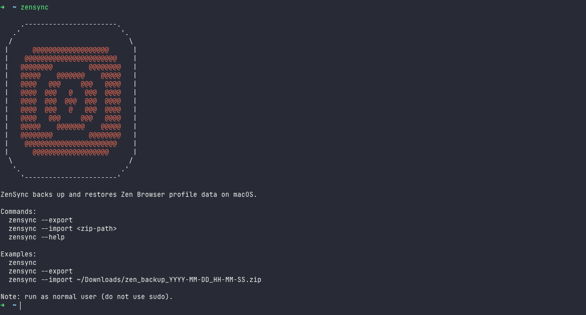

# ZenSync



## Disclaimer

- ZenSync only exports and imports Zen Browser data in your local storage.
- ZenSync does not upload, sync, or store your data on any remote server.
- You are fully responsible for your own data backups, storage, and recovery.
- By using this tool, you accept that data responsibility is with the user, not the developer.

## Introduction

ZenSync is a simple macOS CLI tool to back up and restore Zen Browser profile data.

- Export creates a backup zip from your current Zen profile.
- Import restores a backup zip back into your Zen profile directory.

## Features

Exports everything in your Zen profile directory.
- `Profiles`
- `Workspaces` 
- `Settings`
- `Extensions`
- `Themes`
- `Plugins`
- `Customizations`
- `Preferences`
- `Tabs`
- `Pin Tabs`
- `Folders`
- `History`
- `Zen Mods`


## Requirements

- go 1.22 or higher
- macOS 10.15 or higher
- Zen Browser installed

## Installation

### Option 1: Homebrew

```bash
brew tap krish-mm/tap
brew install zensync
```

### Option 2: Clone and Build

```bash
git clone https://github.com/krish-mm/zensync.git
cd zensync
go build -o zensync .
```

Optional: keep the binary in your drive storage and run it directly from that folder.

```bash
./zensync --help
```

Optional: install globally so you can run `zensync` from anywhere.

```bash
sudo cp zensync /usr/local/bin/zensync
sudo chmod +x /usr/local/bin/zensync
```

## Backup and Restore Flow

### 1. Export Zen data to local storage

```bash
zensync --export
```

This creates a backup zip in your `~/Downloads` directory.

### 2. Store the backup in your drive storage (optional)

Move the generated `zen_backup_*.zip` to any local folder, external drive, or cloud drive folder that you control.

### 3. Import the backup back to Zen

```bash
zensync --import /path/to/zen_backup_YYYY-MM-DD_HH-MM-SS.zip
```

## Note

- Only for macOS.
- Run `zensync` as your normal user. Do not run with `sudo`.

## Issues and Support

If you face any issue:

- Message me on Twitter: [@krishstwt](https://twitter.com/krishstwt)
- Or create an issue in the repo: [github.com/krish-mm/zensync/issues](https://github.com/krish-mm/zensync/issues)
